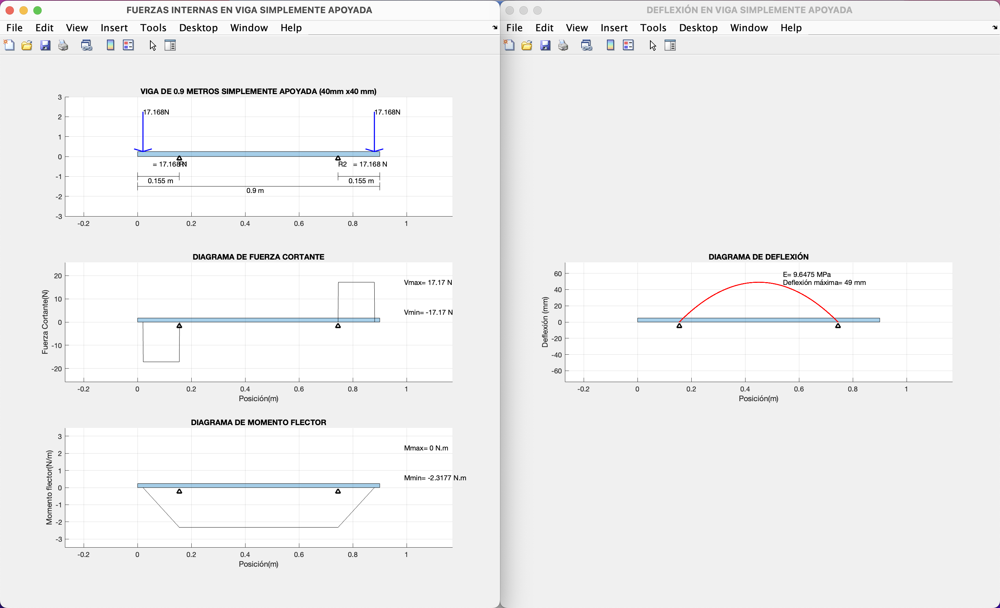

# Structural Analysis Utilities with MATLAB

MatLab projects focused on statics and mechanics of materials of ideal beams. Interactive calculators such as plotters for internal forces diagrams on beams and stress distribution diagrams on thin-walled sections.

